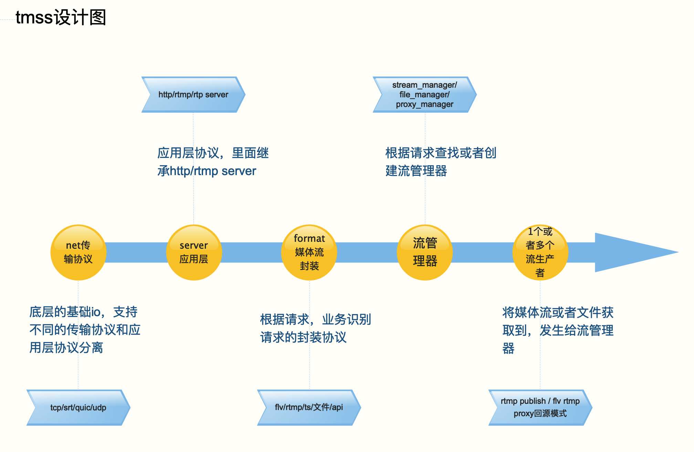

## 1. 目的
TMSS（Tencent MediaStream Server）是高性能可扩展的流媒体server。

## 2. 设计
    

   -----------------------
   | 编程方式 |      协程     |
   ----------------------------
   | 传输 | tcp/udp/srt/quic  |
   ---------------------------
  | 应用 | http/rtmp/rtp      |
   -----------------------------------
  | 协议 | rtmp/flv/ts/hls/rtp/dash  |
  ------------------------------------------
  | 功能 | 推流，回源，api控制流，文件cdn分发  |
  -------------------------------------------

## 3. 代码设计

### 3.1 协程基础类型
```c++
class ICoroutine {
   int start(); // 协程的启动
   int stop();  // 协程的终止  
};

class ICoroutineHandler : public ICoroutine  {
    int cycle(); // 这里是协程去调用的客户的实现
};

ICoroutine* create_co(ICoroutineHandler* handler);
```

### 3.2 io读写
```c++
class IReader {
   int read(buf, size);
}

class IWriter {
   int write(buf, size);
}

class IConn : IReader, IWriter {
    int connect();
    int close();
}
```

#### 3.2.2 网络传输io协议

```c++
class TcpConn : IConn {
    
};

class UdpConn : IConn {
    
};

class HttpConn : TcpConn {    

};

class SrtConn : IConn {
    
};

class QuicConn : IConn {
    
};
```

#### 3.3 应用层server设计

```c++
class IServer {
   int listen();
   int start();
   IConn accept();
}

class RtmpServer : IServer {

}

class HttpServer : IServer {

}

class RtpServer : IServer {

}

```


### 3.4 协议设计
```c++
class IContext {
    
};

class IPacket {
    
};

class IDeMux {
    int read_header(IPacket* packet);
    int read_packet(IContext* ctx, IPacket* packet);
    IContext* ctx；
};

class IMux {
    int write_header(IContext* ctx, IPacket* packet);
    int write_packet(IContext* ctx, IPacket* packet);
    IContext* ctx;
}

```